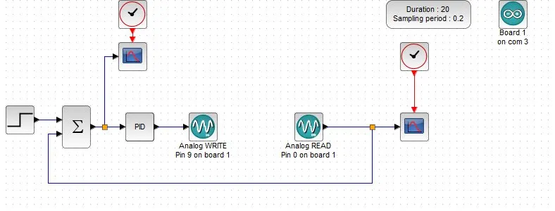

# 🎯 Ball and Beam — Modelo Didático de Controle PID

> Trabalho de Conclusão de Curso — Universidade Estadual do Rio Grande do Sul (UERGS)  
> **"Estudo de um Modelo Didático para Demonstração de Técnicas de Controle PID"**

---

## 📌 Sobre o Projeto

Este projeto consiste no desenvolvimento de um **modelo físico didático do tipo Ball and Beam** com o objetivo de demonstrar, de forma visual e prática, o comportamento de um sistema de controle PID (Proporcional-Integral-Derivativo).

O modelo foi desenvolvido para uso em sala de aula na disciplina de Controle, permitindo que os alunos observem em tempo real:

- O efeito de cada componente do controlador (P, I e D)
- O que acontece quando os ganhos são mal ajustados (oscilação, instabilidade)
- O processo de sintonia do controlador até atingir o comportamento desejado

---

## ⚙️ Como o Sistema Funciona

O sistema é composto por uma **calha inclinável** controlada por um **servo motor**, onde uma **bola** deve ser mantida em uma posição de equilíbrio determinada pelo operador (setpoint).

Um **sensor de distância** mede continuamente a posição da bola. O controlador PID calcula o erro entre a posição desejada e a posição real, e ajusta o ângulo da calha para corrigir o desvio.

```
Setpoint → [Σ] → [PID] → [Servo Motor] → [Calha] → [Bola]
                ↑                                        |
                └──────────── [Sensor Sharp] ←──────────┘
```

---

## 🛠️ Tecnologias Utilizadas

| Componente | Descrição |
|---|---|
| **Arduino** | Microcontrolador responsável pelo controle em tempo real |
| **Servo Motor** | Atuador que inclina a calha |
| **Sensor Sharp 2Y0A21** | Sensor IR para medir a posição da bola |
| **Scilab / Xcos** | Software para monitoramento, aquisição de dados e simulação em tempo real |
| **Comunicação Serial** | Integração entre Arduino e Scilab via porta COM |

---

## 📊 Diagrama de Blocos (Xcos/Scilab)

O diagrama abaixo representa o fluxo de controle implementado no Xcos, com comunicação bidirecional entre o Scilab e o Arduino:



- **Analog WRITE Pin 9** → Envia o sinal de controle para o servo via Arduino
- **Analog READ Pin 0** → Lê a posição atual da bola via sensor
- **Período de amostragem:** 0.2s | **Duração do ensaio:** 20s

---

## 🔢 Parâmetros do Controlador PID

Os ganhos foram ajustados empiricamente para fins demonstrativos, priorizando a visualização do comportamento do sistema:

```
Kp = 8.0
Ki = 0.7
Kd = 1000.0
Setpoint = 13 cm
Período de amostragem = 50 ms
```

> **Nota:** Os valores não representam uma sintonia ótima — o objetivo didático é justamente permitir que os alunos observem o impacto de diferentes configurações de ganhos no comportamento do sistema.

---

## 📁 Estrutura do Repositório

```
ball-and-beam-pid/
│
├── arduino/
│   └── ball_and_beam.ino       # Código do controlador PID embarcado
│
├── scilab/
│   └── testeatoms.zcos         # Diagrama de blocos Xcos para monitoramento
│
├── docs/
│   └── TCC_BallAndBeam.pdf     # Documento completo do TCC
│
├── media/
│   ├── diagrama_xcos.png       # Diagrama de blocos do sistema
│   ├── foto_projeto.jpg        # Foto do modelo físico
│   └── demo.mp4                # Vídeo de demonstração do sistema em operação
│
└── README.md
```

---

## 🚀 Como Reproduzir

### Hardware necessário
- Arduino Uno (ou compatível)
- Servo motor
- Sensor Sharp 2Y0A21
- Estrutura física da calha (ball and beam)

### Software necessário
- [Arduino IDE](https://www.arduino.cc/en/software)
- [Scilab](https://www.scilab.org/) com módulo ATOMS para comunicação serial

### Passos
1. Carregue o arquivo `arduino/ball_and_beam.ino` no Arduino via Arduino IDE
2. Abra o arquivo `scilab/testeatoms.zcos` no Xcos
3. Configure a porta COM correta no bloco Arduino do diagrama
4. Execute a simulação e observe a resposta do sistema em tempo real

---

## 📚 Contexto Acadêmico

Este modelo foi desenvolvido como Trabalho de Conclusão de Curso no curso de **Engenharia de Controle e Automação** da **Universidade Estadual do Rio Grande do Sul (UERGS)**.

O projeto permanece na instituição como recurso didático permanente para as disciplinas de Controle de Sistemas.

---

## 👤 Vítor da Cunha Pereira

Desenvolvido como TCC — UERGS  
Curso de Engenharia de Controle e Automação

---

## 📄 Licença

Este projeto é disponibilizado para fins educacionais e acadêmicos.
